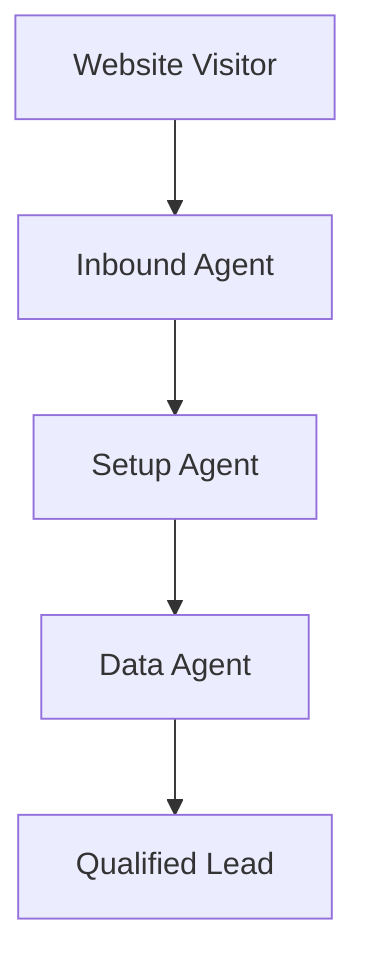

## Overview

Inrepli provides a complete suite of AI-powered tools to automate your B2B lead management. You capture leads from multiple channels, answer inquiries with your knowledge base, qualify and route them intelligently, and manage everything from a unified inbox. These features work together to turn website visitors into booked meetings without manual effort.

<Columns cols={2}>
  <Card title="Agents" icon="bot" href="/docs/agents">
    AI agents handle inbound conversations, setup, and data enrichment automatically.
  </Card>
  <Card title="Capture" icon="mouse-pointer" href="/docs/capture">
    Grab leads from chat, forms, email, and WhatsApp.
  </Card>
  <Card title="Qualify & Route" icon="target" href="/docs/qualify">
    Score leads and send them to the right team member.
  </Card>
  <Card title="Manage" icon="inbox" href="/docs/manage">
    Review conversations and profiles in one place.
  </Card>
</Columns>

## Agents

Inrepli's agents form the core of your automation. The **Inbound Agent** captures and converts leads in real-time. The **Setup Agent** analyzes your website to configure everything automatically. The **Data Agent** enriches leads with company details.



<Callout kind="info">
  Start with the Setup Agent to auto-configure based on your site content.
</Callout>

## Capture Methods

Choose from multiple capture options to meet leads where they are.

<Tabs>
  <Tab title="Website Chat" icon="message-circle">
    Embed a chat widget that qualifies visitors instantly.
    
    ```javascript
    <script src="https://js.inrepli.com/chat.js" data-api-key="YOUR_API_KEY"></script>
    ```
  </Tab>
  <Tab title="Forms" icon="file-text">
    Convert static forms into dynamic lead capture.
    
    ```html
    <form action="https://api.inrepli.com/forms/submit" method="POST">
      <input name="email" type="email" required />
      <button type="submit">Submit</button>
    </form>
    ```
  </Tab>
  <Tab title="Email/WhatsApp" icon="mail">
    Follow up via email or WhatsApp for higher response rates.
  </Tab>
</Tabs>

## Qualify, Route, and Book

Automatically score leads based on fit and intent, then route to the best owner. Qualified leads can self-book meetings.

<Steps>
  <Step title="Qualify Leads" icon="target">
    Define criteria like company size and role.
  </Step>
  <Step title="Route" icon="share">
    Assign based on territory or expertise.
    
````javascript
const lead = {
  email: "lead@example.com",
  company: "Acme Corp",
  score: 85
};
fetch("https://api.inrepli.com/leads/route", {
  method: "POST",
  body: JSON.stringify(lead)
});
````
  </Step>
  <Step title="Book Meetings" icon="calendar">
    Integrate with your calendar for instant scheduling.
  </Step>
</Steps>

<ResponseField name="leadId" field-type="string" required="true">
  Unique ID for the qualified lead.
</ResponseField>
<ResponseField name="routeTo" field-type="string">
  Assigned sales rep email.
</ResponseField>

## Knowledge Base and Answers

Power your agents with a knowledge base for accurate responses. Training tools help identify gaps and improve over time.

<Expandable title="Advanced Training" default-open="false">
  Review conversation transcripts to surface common questions.
  
  <CodeGroup tabs="JavaScript,Python">
  ```javascript
  const insights = await fetch("https://api.inrepli.com/insights");
  console.log(insights.knowledgeGaps);
  ```
  ```python
  import requests
  insights = requests.get("https://api.inrepli.com/insights").json()
  print(insights["knowledge_gaps"])
  ```
  </CodeGroup>
</Expandable>

## Manage and Control

<Board title="Lead Workflow">
  <BoardColumn title="Captured" color="0" icon="mouse-pointer">
    <BoardCard title="Website Chat Lead" description="New visitor inquiry" createdAt="2024-10-01" />
  </BoardColumn>
  <BoardColumn title="Qualified" color="1" icon="target">
    <BoardCard title="High Intent" description="Score >80, tech buyer" dueDate="2024-10-10" author="AI Agent" />
  </BoardColumn>
  <BoardColumn title="Booked" color="2" icon="calendar">
    <BoardCard title="Demo Scheduled" description="With Sarah, AE" />
  </BoardColumn>
</Board>

<Callout kind="tip">
  Use agent controls to set escalation rules for complex leads.
</Callout>

These features integrate seamlessly. Customize rules and monitor performance from the unified inbox and profiles.